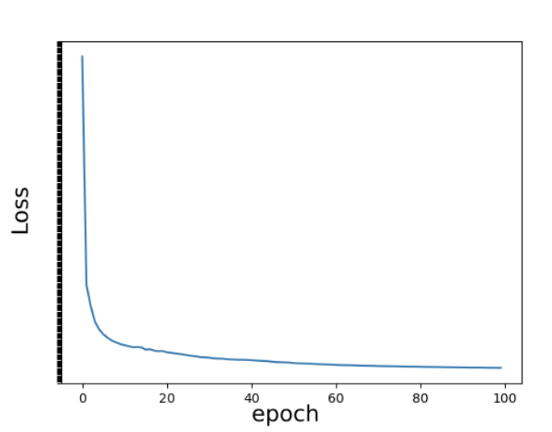

# Semantic Similarity with Siamese neural network (Manhattan_LSTM)
Сопоставление названий компаний с помощью Сиамской нейронной сети

## Getting started

Requirements

* Python >= 3.7
* GPU >= 16GB
* CUDA >= 11.3

1) Приведение набора данных к формату .tsv:

````
$ python Datasets/csv_to_tsv.py
````

2) Запуск обучения:

````
$ python PyTorch/main.py
````

3) Инференс (TO DO):

````
$ python inf.py
````

## Dataset
В наборе данных 4 столбца и 497819 строк. Данные имеют слеедующий вид:

| pair_id |         name_1          |                name_2                | is_duplicate | 
|:-------:|:-----------------------:|:------------------------------------:|:------------:|
|    1    |   Iko Industries Ltd.   | Enormous Industrial Trade Pvt., Ltd. |      0       | 
|    2    | Pirelli Neumaticos SAIC |        Pirelli Tyre Co., Ltd.        |      1       | 
|   ...   |           ...           |                 ...                  |     ...      |

где pair_id - id пары, name_1 - первое название, name_2 - второе название, is_duplicate - являются ли названия из name_1 и name_2 дубликатами (0 - нет, 1 - да). Названия компаний 
преимущественно на английском языке, но также встречаются другие языки (русский и турецкий).

Распределение по категориям в наборе данных неравномерно.

| is_duplicate |    Count     |
|:------------:|:------------:|
|      0       |    494161    |
|      1       |     3658     |

Данные можно загрузить по [ссылке](https://drive.google.com/file/d/1e9bdr7wcQX_YBudQcsKj-sMoIGxQOlK4/view?usp=sharing).

## Model
Для решения задачи определения сходство между парами названий была выбрана архитектура сиамской нейронной сети 
[Manhattan_LSTM](https://github.com/fionn-mac/Manhattan-LSTM). В модели есть две идентичные сети LSTM. LSTM передает 
векторные представления предложений и выводит скрытое состояние, кодирующее семантическое значение предложений. 
Впоследствии эти скрытые состояния сравниваются с и спользованием механизма сходства для вывода оценки сходства. 
Изначальный проект был изменен для работы на наших данных.  


Первоначальные эмбеддинги для слов берутся из GoogleNews-vectors-negative300.bin.gz, загрузить можно по
[ссылке](https://drive.google.com/file/d/0B7XkCwpI5KDYNlNUTTlSS21pQmM/edit?resourcekey=0-wjGZdNAUop6WykTtMip30g).

Параметры моделей и результаты валидации на тестовой выборке представлены в таблице. Manhattan_LSTM_1 и Manhattan_LSTM_2
обучались на полном неравномерном наборе данных, Manhattan_LSTM_3 и Manhattan_LSTM_4 на равномерном сэмпле. 

Обученную Manhattan_LSTM_1 можно скачать по [ссылке](https://drive.google.com/drive/folders/1XwE5d1t_HL5soXdWDNRHGZBy0CaofA5P?usp=sharing).
Обученную Manhattan_LSTM_3 можно скачать по [ссылке](https://drive.google.com/drive/folders/1P16lsCTu7P1q3GmOjTd3qY5ptKSqELmL?usp=sharing).

|       Model       | Manhattan_LSTM_1 | Manhattan_LSTM_2 | Manhattan_LSTM_3 | Manhattan_LSTM_4 |
|:-----------------:|:----------------:|:----------------:|:----------------:|:----------------:|
|      Params       |      Params      |      Params      |      Params      |      Params      |
|    Hidden Size    |        50        |        30        |        50        |        30        |
|    Batch Size     |        32        |        16        |        32        |        16        |
| Max. input length |        20        |        10        |        20        |        10        |
|   Learning rate   |      0.001       |      0.002       |      0.001       |      0.001       |
| Number of epochs  |       100        |       100        |       100        |       100        |

|       Model       | Manhattan_LSTM_1 | Manhattan_LSTM_2 | Manhattan_LSTM_3 | Manhattan_LSTM_4 |
|:-----------------:|:----------------:|:----------------:|:----------------:|:----------------:|
|      Metrix       |      Metrix      |      Metrix      |      Metrix      |      Metrix      |
|     Accuracy      |      98.86       |      99.81       |      94.94       |      94.05       |
|       Loss        |       3.90       |      10.57       |       2.22       |       5.16       |
|     Precision     |      94.59       |      94.64       |      93.59       |      91.01       |
|      Recall       |      85.36       |      77.85       |      93.17       |      93.78       |

График потерь Manhattan_LSTM_1:

<p align="left"></p>


## Comparison 
Для оценки качества работы обученной сиамской нейронной сети результаты ее работы сравнили с обработкой NLP библиотеки FuzzyWuzzy, с помощью которой можно произвести нечёткое сравнение строк (расстояние Левенштейна).

|                Model                | Accuracy | Precision | Recall  |
|:-----------------------------------:|:--------:|:---------:|---------|
|          Manhattan_LSTM_1           |  98.86   |   94.59   |  85.36  |
|         Fuzzywuzzy(WRatio)          |  79.34   |   1.900   |  56.13  |
|     Fuzzywuzzy(token_set_ratio)     |  96.89   |   6.001   |  23.37  |
| Fuzzywuzzy(partial_token_set_ratio) |  60.73   |   1.715   |  97.55  |

По результатам экспериментов, обученная сиамская нейросеть демонстрирует лучшие результаты.
